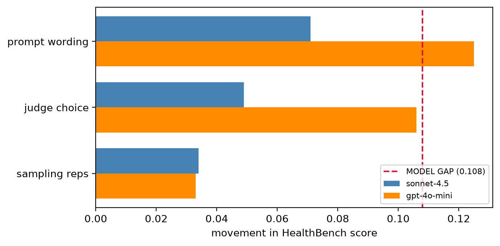

# judgeaudit: a reliability audit for LLM-as-judge medical evals



**LLM judges decide medical-AI leaderboards, but nobody reports the judge's error bars.** This toolkit re-grades OpenAI HealthBench's physician-labelled meta-evaluation with a grid of LLM judges and measures what usually goes unmeasured: how well judges agree with physicians, how much a model's score moves when you change the judge or the prompt wording rather than the model, and whether a typical eval even has the statistical power to call a winner. The headline: **on this benchmark, switching the judge's prompt wording moves a model's score almost as much as the entire gap between the two models being compared.**

## Quickstart (no API key)

```bash
git clone <your-repo-url> medjudge-audit && cd medjudge-audit
uv sync                      # or: pip install -e .
judgeaudit report demo_grades.jsonl --track-b demo_grades_track_b.jsonl -o report.md
# or open demo.ipynb and Run All — renders the report card in under a minute
```

The demo reads small committed grade samples (`demo_grades*.jsonl`) and never calls an API. `judgeaudit report demo_grades.jsonl` alone renders the agreement sections; adding `--track-b` renders the sensitivity and power sections too.

## The report card for HealthBench judges (full run)

*Judges: `openai/gpt-4.1` (the official HealthBench grader), `anthropic/claude-sonnet-4.5`, `google/gemini-2.5-flash`. Response models compared: `anthropic/claude-sonnet-4.5` vs `openai/gpt-4o-mini`.*

**1. Agreement with physicians** (Track A, 2,000 physician-labelled items)

| judge | % agree | Cohen's κ | macro-F1 |
|---|---|---|---|
| openai/gpt-4.1 | 0.892 | **0.601** | 0.801 |
| google/gemini-2.5-flash | 0.885 | 0.497 | 0.747 |
| anthropic/claude-sonnet-4.5 | 0.773 | 0.407 | 0.690 |

The strongest *response* model (sonnet-4.5) is the weakest *judge*. Grading and answering are different skills. Every judge collapses to κ ≈ 0.09–0.15 on judgment-call ("was this complex response appropriate?") criteria while managing 0.5–0.8 on factual ones.

**2. Uncertainty** with clustered 95% CIs (resampling *conversations*, not criteria)

gpt-4.1 agreement 0.892 [0.877, 0.908] sits entirely above sonnet's 0.771 [0.750, 0.793], which is a real ranking difference.

**3. Sensitivity** aka how far a model's HealthBench score moves from choices that shouldn't matter vs the real model gap:

| source | spread | vs model gap |
|---|---|---|
| sampling reps (temp 1.0) | 0.034 | 31% |
| judge choice | 0.078 | 72% |
| prompt wording | 0.098 | **91%** |
| **model gap** | **0.108** | — |

For the *weaker* model the prompt-wording spread (0.125) actually **exceeds** the model gap. Its score depends more on the judge prompt than on which model it is.

**4. Power**. With n=402 examples the minimum detectable gap at 80% power is ≈ 0.035. The observed 0.108 model gap is detectable, but any gap below ~0.035 would not be detectable (see `docs/fig_power.png`).

**Other findings:** 
- verbosity bias is real and systemic (conditioning on physician labels, longer responses are graded "met" more readily and is strongest in the *best* judge)
- judges are **~2× less consistent on harm/safety criteria** (25.9% vs 12.2% verdict-flip rate)
- clustering correction's *direction* depends on the estimand (it widens single-model CIs but tightens the paired model-difference CI)

## Use it on your own eval

`report_card` works on any grades in the same row schema — a different rubric produces the same report:

```python
import pandas as pd
from judgeaudit import report_card, cluster_bootstrap, power_curve

track_a = pd.read_json("your_grades.jsonl", lines=True)      # judge vs human labels
print(report_card(track_a))                                  # sections 1-2
```

- **Track A rows** (agreement): `judge_model, variant, grade (bool), physician_label (bool), prompt_id`.
- **Track B rows** (optional grid → sensitivity + power): `response_model, judge_model, variant, run_tag, criterion_idx, points (int), grade, prompt_id`.

Pass `ref_judge=` / `ref_variant=` to `report_card` to set the canonical config the sensitivity and power sections anchor on.

## Methods notes

- **Ground truth is multi-physician, never the author.** Track A re-grades triples that physicians already labelled; we audit agreement and *characterize* disagreements. We never act as a sole grader.
- **Cluster every CI by conversation.** Criteria within a conversation are correlated. Treating them as independent understates uncertainty. `cluster_bootstrap` resamples whole conversations.
- **Scores use the HealthBench recipe.** Sum of points for met criteria over the sum of positive points, clipped at 0; negative-point (harm) criteria can only subtract.
- **Every random step is seeded** and every figure regenerates identically.

## Limitations

- **One benchmark, one language.** Everything here is HealthBench, English-only. The dead zone on judgment-call criteria and the verbosity tilt may not transfer to other rubrics or languages.
- **Physician labels are not perfect ground truth.** Panels are 2–3 physicians and disagree often (evenly-split panels are dropped as "not ground truth"). Some apparent judge errors are label noise, but the physician labels still set the ceiling on measurable agreement.
- **Self-preference is underpowered.** With n=100 the judge×model interaction CI includes zero (inconclusive), and no judge in the grid is *also* a response model, so only provider-level affinity was even testable.
- **Two response models, a wide gap.** The power and variance results are anchored on one model pair with a real quality gap.
- **Judge/response-model set is fixed** and small (≤3 judges, ≤4 prompt variants), which was a deliberate scope choice, so the reported spreads are *minimums*. A larger config space could only widen them.

## Repo layout

```
src/judgeaudit/   data.py llm.py generate.py judge.py agreement.py uncertainty.py
                  scoring.py variance.py power.py report.py cli.py
scripts/          run_a1.py … run_b3.py, make_report.py     # batch drivers
notebooks/        01_explore … 09_deep-dive                 # exploration + analysis
docs/             tutorial.pdf, runbook.pdf, figures
demo.ipynb, demo_grades*.jsonl                              # offline demo
```
